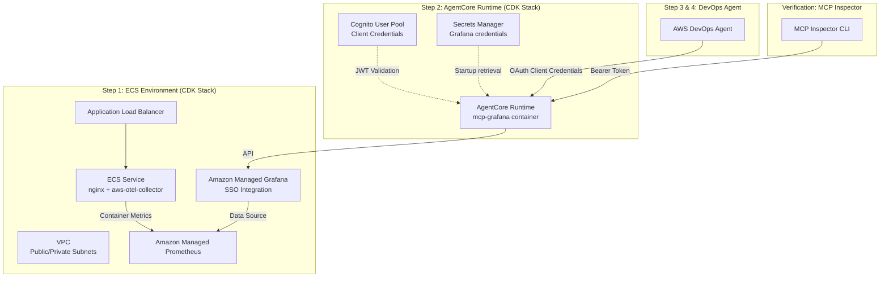
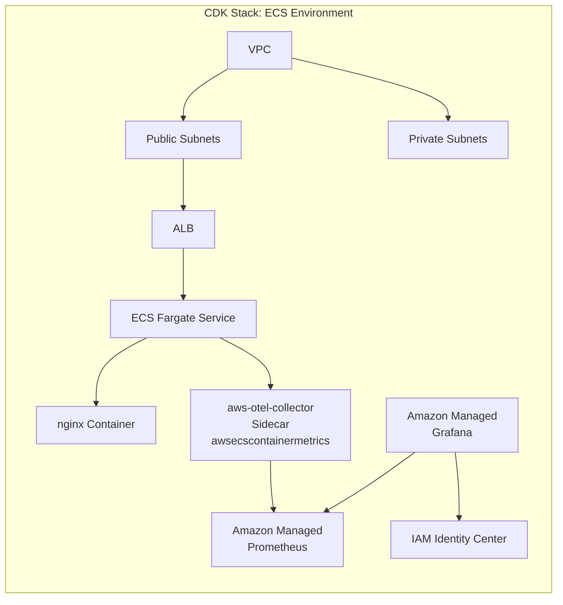

# DevOps Agent + ECS + Grafana MCP Tutorial

## Update

With the General Availability of AWS DevOps Agent, Grafana integration is now natively supported.
https://aws.amazon.com/jp/blogs/mt/announcing-general-availability-of-aws-devops-agent/

As a result, the setup described in "Step 2: Deploy Grafana MCP Server on AgentCore Runtime" and "Step 3: Connect MCP Server to DevOps Agent" can now be accomplished by following the official documentation:
https://docs.aws.amazon.com/devopsagent/latest/userguide/connecting-telemetry-sources-connecting-grafana.html

## Overview

This tutorial walks through the end-to-end process of using AWS DevOps Agent with a Grafana MCP server to investigate ECS environment metrics.

The tutorial consists of 4 steps:

1. **Build the ECS Environment** — Deploy VPC, ALB, ECS Service (nginx + aws-otel-collector), Amazon Managed Prometheus, and Amazon Managed Grafana using CDK
2. **Deploy Grafana MCP Server on AgentCore Runtime** — Deploy mcp-grafana on AgentCore Runtime with Cognito JWT authentication using CDK
3. **Connect MCP Server to DevOps Agent** — Connect the MCP server to AWS DevOps Agent
4. **Investigate with DevOps Agent** — Use the agent to investigate metrics via Grafana

## Architecture



## Prerequisites

Before starting this tutorial, ensure the following are in place.

### Required Tools

| Tool | Version | Purpose |
|------|---------|---------|
| [AWS CLI v2](https://docs.aws.amazon.com/cli/latest/userguide/getting-started-install.html) | v2+ | AWS resource operations |
| [Node.js](https://nodejs.org/) | 18+ | CDK runtime |
| [AWS CDK v2](https://docs.aws.amazon.com/cdk/v2/guide/getting-started.html) | v2+ | Infrastructure deployment |
| [Docker](https://www.docker.com/get-started/) | Latest | Used for Step 2 MCP server build |
| [MCP Inspector](https://github.com/modelcontextprotocol/inspector) | Latest | MCP server connection testing (via `npx @modelcontextprotocol/inspector`) |

### AWS Environment Prerequisites

- AWS CLI is configured (`aws configure` completed)
- **IAM Identity Center (SSO) is enabled in the target region** (assumed to be pre-configured)
  - Amazon Managed Grafana workspaces use SSO authentication, so IAM Identity Center must be enabled in the deployment region
  - If not enabled, the CDK deployment will fail
- Amazon Managed Prometheus and Amazon Managed Grafana are supported in the target region

---


## Step 1: Build the ECS Environment

This step deploys the following resources using CDK:

- VPC (Public/Private Subnets, NAT Gateway)
- Application Load Balancer (ALB)
- ECS Fargate Service (nginx + aws-otel-collector sidecar)
- Amazon Managed Prometheus workspace
- Amazon Managed Grafana workspace (SSO integration)



### 1.1 Clone the Repository

```bash
cd ~/
git clone https://github.com/aws-samples/sample-aws-devops-agent-ecs-grafana-mcp.git
cd sample-aws-devops-agent-ecs-grafana-mcp
```

### 1.2 CDK Deployment

#### Install Dependencies

```bash
cd cdk
npm install
```

#### CDK Bootstrap (first time only)

If this is the first time using CDK in the target AWS account/region, run bootstrap:

```bash
npx cdk bootstrap
```

#### Run Deployment

```bash
npx cdk deploy
```

Deployment takes approximately 10-15 minutes. When prompted to confirm IAM resource creation, enter `y` to continue.

### 1.3 Verify Deployment Results

Once deployment is complete, the following outputs will be displayed:

```
Outputs:
EcsObservabilityStack.AlbDnsName = <ALB DNS Name>
EcsObservabilityStack.VpcId = <VPC ID>
EcsObservabilityStack.PublicSubnetIds = <Public Subnet IDs (comma-separated)>
EcsObservabilityStack.PrivateSubnetIds = <Private Subnet IDs (comma-separated)>
EcsObservabilityStack.AmpWorkspaceId = <Amazon Managed Prometheus Workspace ID>
EcsObservabilityStack.AmpEndpoint = <Amazon Managed Prometheus Remote Write Endpoint>
EcsObservabilityStack.AmpQueryEndpoint = <Amazon Managed Prometheus Query Endpoint>
EcsObservabilityStack.AmgWorkspaceUrl = <Amazon Managed Grafana Workspace URL>
EcsObservabilityStack.AmgWorkspaceId = <Amazon Managed Grafana Workspace ID>
```

| Output Key | Description | Used In |
|-----------|-------------|---------|
| `AlbDnsName` | ALB DNS name | Verify nginx is running |
| `VpcId` | VPC ID | Reuse VPC in Step 2 CDK deployment |
| `PublicSubnetIds` | Public Subnet IDs (comma-separated) | Reuse VPC in Step 2 CDK deployment |
| `PrivateSubnetIds` | Private Subnet IDs (comma-separated) | Reuse VPC in Step 2 CDK deployment |
| `AmpWorkspaceId` | Amazon Managed Prometheus Workspace ID | Prometheus MCP server configuration |
| `AmpEndpoint` | Amazon Managed Prometheus Remote Write Endpoint | aws-otel-collector destination (auto-configured) |
| `AmpQueryEndpoint` | Amazon Managed Prometheus Query Endpoint | Grafana data source URL configuration |
| `AmgWorkspaceUrl` | Amazon Managed Grafana Workspace URL | Browser dashboard access, Grafana MCP server configuration |
| `AmgWorkspaceId` | Amazon Managed Grafana Workspace ID | Grafana MCP server configuration |

To re-check the output values after deployment:

```bash
aws cloudformation describe-stacks \
  --stack-name EcsObservabilityStack \
  --query 'Stacks[0].Outputs' \
  --output table
```

#### Set Environment Variables

Set the CDK output values as environment variables so that subsequent commands can be copy-pasted directly:

```bash
export ALB_DNS_NAME=$(aws cloudformation describe-stacks --stack-name EcsObservabilityStack --query 'Stacks[0].Outputs[?OutputKey==`AlbDnsName`].OutputValue' --output text)
export VPC_ID=$(aws cloudformation describe-stacks --stack-name EcsObservabilityStack --query 'Stacks[0].Outputs[?OutputKey==`VpcId`].OutputValue' --output text)
export PUBLIC_SUBNET_IDS=$(aws cloudformation describe-stacks --stack-name EcsObservabilityStack --query 'Stacks[0].Outputs[?OutputKey==`PublicSubnetIds`].OutputValue' --output text)
export PRIVATE_SUBNET_IDS=$(aws cloudformation describe-stacks --stack-name EcsObservabilityStack --query 'Stacks[0].Outputs[?OutputKey==`PrivateSubnetIds`].OutputValue' --output text)
export AMP_WORKSPACE_ID=$(aws cloudformation describe-stacks --stack-name EcsObservabilityStack --query 'Stacks[0].Outputs[?OutputKey==`AmpWorkspaceId`].OutputValue' --output text)
export AMP_ENDPOINT=$(aws cloudformation describe-stacks --stack-name EcsObservabilityStack --query 'Stacks[0].Outputs[?OutputKey==`AmpEndpoint`].OutputValue' --output text)
export AMP_QUERY_ENDPOINT=$(aws cloudformation describe-stacks --stack-name EcsObservabilityStack --query 'Stacks[0].Outputs[?OutputKey==`AmpQueryEndpoint`].OutputValue' --output text)
export AMG_WORKSPACE_URL=$(aws cloudformation describe-stacks --stack-name EcsObservabilityStack --query 'Stacks[0].Outputs[?OutputKey==`AmgWorkspaceUrl`].OutputValue' --output text)
export AMG_WORKSPACE_ID=$(aws cloudformation describe-stacks --stack-name EcsObservabilityStack --query 'Stacks[0].Outputs[?OutputKey==`AmgWorkspaceId`].OutputValue' --output text)
```

Verify the environment variables:

```bash
echo "ALB_DNS_NAME:      $ALB_DNS_NAME"
echo "VPC_ID:            $VPC_ID"
echo "PUBLIC_SUBNET_IDS: $PUBLIC_SUBNET_IDS"
echo "PRIVATE_SUBNET_IDS:$PRIVATE_SUBNET_IDS"
echo "AMP_WORKSPACE_ID:  $AMP_WORKSPACE_ID"
echo "AMP_QUERY_ENDPOINT:$AMP_QUERY_ENDPOINT"
echo "AMG_WORKSPACE_URL: $AMG_WORKSPACE_URL"
echo "AMG_WORKSPACE_ID:  $AMG_WORKSPACE_ID"
```

Verify nginx is running:

```bash
curl http://$ALB_DNS_NAME
```

If deployed successfully, the nginx default page will be returned.

### 1.4 Configure User Access to Amazon Managed Grafana

To log in to the Amazon Managed Grafana workspace, you need to assign users or groups from IAM Identity Center to the workspace.

> **Reference**: [Manage user and group access to Amazon Managed Grafana workspaces](https://docs.aws.amazon.com/grafana/latest/userguide/AMG-manage-users-and-groups-AMG.html)

1. Open the [Amazon Managed Grafana console](https://console.aws.amazon.com/grafana/)
2. Select **All workspaces** from the left menu
3. Select the workspace deployed in Step 1.2
4. Select the **Authentication** tab
5. Click **Configure users and user groups**
6. Select the checkbox for the user you want to grant access to, then click **Assign user**
7. Select the assigned user and click **Make admin** to grant admin privileges (admin privileges are required to create a service account in Step 1.6)

Once user assignment is complete, access `$AMG_WORKSPACE_URL` and verify you can log in via SSO.

### 1.5 Configure Amazon Managed Prometheus Data Source

Configure a data source so that Amazon Managed Grafana can query metrics from Amazon Managed Prometheus.

1. Access `$AMG_WORKSPACE_URL` in your browser and log in via SSO
2. Navigate to **Connections** → **Data sources** in the left menu
3. Click **Add data source** and select **Prometheus**
4. Enter the following settings:

| Setting | Value |
|---------|-------|
| **Name** | `Amazon Managed Prometheus` (or any name) |
| **Prometheus server URL** | `$AMP_QUERY_ENDPOINT` (use the environment variable value) |
| **Authentication** → **SigV4 auth** | Enabled |
| **SigV4 Auth Details** → **Authentication Provider** | `Workspace IAM Role` |
| **SigV4 Auth Details** → **Default Region** | Your deployment region (e.g., `ap-northeast-1`) |

- Use the value of the `$AMP_QUERY_ENDPOINT` environment variable from Step 1.3
- SigV4 authentication automatically uses the IAM role of the Amazon Managed Grafana workspace created by CDK

5. Click **Save & test** to verify the connection. If "Successfully queried the Prometheus API." is displayed, the configuration is complete.

### 1.6 Verification: Confirm Metrics

Verify that the ECS environment is deployed correctly and metrics are being collected. This verification uses [mcp-grafana](https://github.com/grafana/mcp-grafana) and [MCP Inspector](https://github.com/modelcontextprotocol/inspector) CLI mode.

> **Note**: It may take a few minutes for metrics to appear in Amazon Managed Prometheus. If verifying immediately after deployment, wait approximately 5 minutes before proceeding.

#### Download mcp-grafana v0.8.2

> **Important**: This tutorial uses mcp-grafana **version 0.8.2** due to [Issue #524](https://github.com/grafana/mcp-grafana/issues/524), which causes the latest version to fail with Amazon Managed Grafana. Once this issue is resolved, update the Dockerfile and the commands below to use the latest version.

```bash
# macOS (Apple Silicon)
curl -sL https://github.com/grafana/mcp-grafana/releases/download/v0.8.2/mcp-grafana_Darwin_arm64.tar.gz | tar xz -C scripts/

# macOS (Intel)
curl -sL https://github.com/grafana/mcp-grafana/releases/download/v0.8.2/mcp-grafana_Darwin_x86_64.tar.gz | tar xz -C scripts/

# Linux (x86_64)
curl -sL https://github.com/grafana/mcp-grafana/releases/download/v0.8.2/mcp-grafana_Linux_x86_64.tar.gz | tar xz -C scripts/

chmod +x scripts/mcp-grafana
```

#### Create a Service Account Token

Create a service account token in the Amazon Managed Grafana workspace (see [Service accounts in Amazon Managed Grafana](https://docs.aws.amazon.com/grafana/latest/userguide/service-accounts.html) for details):

1. Access `$AMG_WORKSPACE_URL` in your browser and log in via SSO
2. Navigate to **Administration** → **Service accounts** in the left menu
3. Click **Add service account** and set the Role to `Viewer`
4. Click **Add service account token** on the created service account to generate a token
5. Copy the displayed token and set it as an environment variable:

```bash
export GRAFANA_SERVICE_ACCOUNT_TOKEN=<token created above>
```

#### Verify with MCP Inspector CLI

Use MCP Inspector CLI mode to verify that mcp-grafana can connect to Amazon Managed Grafana and retrieve metrics.

First, verify that the MCP server starts and lists available tools:

```bash
npx @modelcontextprotocol/inspector --cli ./scripts/mcp-grafana \
  -e GRAFANA_URL=$AMG_WORKSPACE_URL \
  -e GRAFANA_SERVICE_ACCOUNT_TOKEN=$GRAFANA_SERVICE_ACCOUNT_TOKEN \
  --method tools/list
```

If a list of Grafana MCP tools (e.g., `list_datasources`, `query_prometheus`, etc.) is displayed, the MCP server is working correctly.

Next, verify that datasources are accessible:

```bash
npx @modelcontextprotocol/inspector --cli ./scripts/mcp-grafana \
  -e GRAFANA_URL=$AMG_WORKSPACE_URL \
  -e GRAFANA_SERVICE_ACCOUNT_TOKEN=$GRAFANA_SERVICE_ACCOUNT_TOKEN \
  --method tools/call --tool-name list_datasources
```

If the Amazon Managed Prometheus datasource is listed, the Grafana MCP server can successfully communicate with Amazon Managed Grafana.

> **Note**: The Grafana MCP server used in this Step 1 verification directly accesses the Amazon Managed Grafana API. In Step 2, the Grafana MCP server will be deployed on AgentCore Runtime with Cognito JWT authentication for a more secure, production-ready setup.

---

## Step 2: Deploy Grafana MCP Server on AgentCore Runtime

This step deploys the Grafana MCP server ([mcp-grafana](https://github.com/grafana/mcp-grafana) v0.8.2) on AgentCore Runtime with Cognito JWT authentication.

```
MCP Inspector CLI → Cognito (JWT) → AgentCore Runtime → mcp-grafana → Amazon Managed Grafana → Amazon Managed Prometheus
```

### 2.1 Store Grafana Credentials in Secrets Manager

Store the Grafana connection info (from Step 1.6) in Secrets Manager. The AgentCore Runtime container will retrieve these at startup.

```bash
aws secretsmanager create-secret \
  --name grafana-mcp/config \
  --secret-string "{\"url\":\"$AMG_WORKSPACE_URL\",\"token\":\"$GRAFANA_SERVICE_ACCOUNT_TOKEN\"}"
```

> **Important**: Amazon Managed Grafana service account tokens have a maximum expiration of 30 days. When the token expires, you need to:
> 1. Create a new service account token in the Amazon Managed Grafana console
> 2. Update the Secrets Manager secret:
>    ```bash
>    aws secretsmanager put-secret-value \
>      --secret-id grafana-mcp/config \
>      --secret-string "{\"url\":\"$AMG_WORKSPACE_URL\",\"token\":\"<new token>\"}"
>    ```
> 3. Update the AgentCore Runtime to restart the container and pick up the new secret. Since the container retrieves the secret only at startup, you need to trigger a redeployment. For example, add or change an environment variable in the `environmentVariables` of the `Runtime` construct in `cdk/lib/agentcore-stack.ts` (e.g., `SECRET_UPDATED_AT: '2026-04-01'`) and run `npx cdk deploy AgentCoreStack` to force a new container deployment.

### 2.2 CDK Deployment

Deploy the AgentCore Runtime stack. [Finch](https://github.com/runfinch/finch) is used as the container build tool.

```bash
cd ~/sample-aws-devops-agent-ecs-grafana-mcp/cdk
npm install
CDK_DOCKER=finch npx cdk deploy AgentCoreStack \
  -c grafanaSecretName="grafana-mcp/config" \
  --require-approval never
```

> **Note**: If you use Docker instead of Finch, omit the `CDK_DOCKER=finch` prefix.

The following resources will be created:

- Cognito User Pool (JWT authentication via Client Credentials flow)
- AgentCore Runtime (runs the mcp-grafana container with MCP protocol)
- CloudWatch Logs delivery for AgentCore Runtime application logs

### 2.3 Set Post-Deployment Environment Variables

Retrieve Cognito and AgentCore info from CloudFormation Outputs and save to `.env`.

```bash
cd ~/sample-aws-devops-agent-ecs-grafana-mcp

# Retrieve values from CloudFormation Outputs
export COGNITO_TOKEN_ENDPOINT=$(aws cloudformation describe-stacks --stack-name AgentCoreStack \
  --query 'Stacks[0].Outputs[?OutputKey==`CognitoTokenEndpoint`].OutputValue' --output text)
export COGNITO_CLIENT_ID=$(aws cloudformation describe-stacks --stack-name AgentCoreStack \
  --query 'Stacks[0].Outputs[?OutputKey==`CognitoClientId`].OutputValue' --output text)
export AGENTCORE_RUNTIME_ARN=$(aws cloudformation describe-stacks --stack-name AgentCoreStack \
  --query 'Stacks[0].Outputs[?OutputKey==`RuntimeId`].OutputValue' --output text)
AGENTCORE_RUNTIME_ARN="arn:aws:bedrock-agentcore:ap-northeast-1:$(aws sts get-caller-identity --query Account --output text):runtime/$AGENTCORE_RUNTIME_ARN"

# Cognito Client Secret is not in CFn Outputs; retrieve via AWS CLI
export COGNITO_USER_POOL_ID=$(aws cloudformation describe-stacks --stack-name AgentCoreStack \
  --query 'Stacks[0].Outputs[?OutputKey==`CognitoUserPoolId`].OutputValue' --output text)
export COGNITO_CLIENT_SECRET=$(aws cognito-idp describe-user-pool-client \
  --user-pool-id "$COGNITO_USER_POOL_ID" --client-id "$COGNITO_CLIENT_ID" \
  --query 'UserPoolClient.ClientSecret' --output text)

# Append to .env
cat >> .env << EOF

# Cognito credentials
COGNITO_TOKEN_ENDPOINT=$COGNITO_TOKEN_ENDPOINT
COGNITO_CLIENT_ID=$COGNITO_CLIENT_ID
COGNITO_CLIENT_SECRET=$COGNITO_CLIENT_SECRET
COGNITO_SCOPE=mcp-api/access

# AgentCore Runtime
AGENTCORE_RUNTIME_ARN=$AGENTCORE_RUNTIME_ARN
EOF
```

### 2.4 Verification: MCP Inspector CLI

Test connectivity to AgentCore Runtime using [MCP Inspector](https://github.com/modelcontextprotocol/inspector) CLI mode. The script reads credentials from `.env`, obtains a Cognito token, and runs the test automatically.

```bash
cd ~/sample-aws-devops-agent-ecs-grafana-mcp

# Run tools/list (default)
./scripts/mcp-inspect.sh

# Other methods
./scripts/mcp-inspect.sh resources/list
./scripts/mcp-inspect.sh prompts/list
```

If `tools/list` returns a list of Grafana MCP tools, the AgentCore Runtime is working correctly.

---

## Step 3: Connect MCP Server to DevOps Agent

This step connects the AgentCore Runtime deployed in Step 2 to AWS DevOps Agent. DevOps Agent accesses the MCP server using OAuth Client Credentials flow via Cognito.

> **Reference**: [Connecting MCP servers - AWS DevOps Agent](https://docs.aws.amazon.com/devopsagent/latest/userguide/configuring-capabilities-for-aws-devops-agent-connecting-mcp-servers.html)

### 3.1 Access the DevOps Agent Console

1. Log in to the AWS Management Console
2. Search for **DevOps Agent** and open the DevOps Agent console

### 3.2 Create a Space

1. Click **Create space** in the DevOps Agent console
2. Enter a Space name (e.g., `grafana-mcp-tutorial`)
3. Add a description if needed
4. Click **Create** to create the Space

### 3.3 Configure MCP Server Connection

1. Select the created Space
2. Navigate to the **MCP servers** tab
3. Click **Add MCP server**
4. Retrieve the configuration values from the `.env` file:

```bash
cd ~/sample-aws-devops-agent-ecs-grafana-mcp
source .env

# Build the AgentCore Runtime endpoint URL
ENCODED_ARN=$(python3 -c "import urllib.parse; print(urllib.parse.quote('${AGENTCORE_RUNTIME_ARN}', safe=''))")
ENDPOINT="https://bedrock-agentcore.ap-northeast-1.amazonaws.com/runtimes/${ENCODED_ARN}/invocations?qualifier=DEFAULT"

echo "Endpoint URL:  $ENDPOINT"
echo "Client ID:     $COGNITO_CLIENT_ID"
echo "Client Secret: $COGNITO_CLIENT_SECRET"
echo "Exchange URL:  $COGNITO_TOKEN_ENDPOINT"
```

5. Copy the values displayed by the commands above and enter them in the corresponding fields:

| Setting | Corresponding Value |
|---------|---------------------|
| **Endpoint URL** | AgentCore Runtime invocations URL (displayed above) |
| **Flow** | OAuth Client Credentials |
| **Client ID** | Value of `$COGNITO_CLIENT_ID` |
| **Client Secret** | Value of `$COGNITO_CLIENT_SECRET` |
| **Exchange URL** | Value of `$COGNITO_TOKEN_ENDPOINT` |

> **Note**: Environment variables are not expanded in the DevOps Agent console, so copy and paste the actual values displayed by the `echo` commands.

6. After entering all values, click **Save** to save the MCP server connection configuration.

---

## Step 4: Investigate with DevOps Agent

This step uses the DevOps Agent with the MCP server connected in Step 3 to investigate ECS environment metrics.

### 4.1 Run the Investigation

1. Open the Space created in Step 3 in the DevOps Agent console
2. Enter the following prompt in the chat interface:

```
Use the MCP server to show the average CPU utilization of services in ECS cluster ecs-observability
```

3. DevOps Agent will retrieve metrics data from Amazon Managed Prometheus through the connected Grafana MCP server, analyze the ECS cluster CPU utilization, and display the results.

### 4.2 Success Criteria

The tutorial is successfully completed if the following conditions are met:

- **DevOps Agent uses MCP to retrieve and display metrics information in the investigation log**

Specifically, verify that the DevOps Agent response includes the following:

1. The log shows that DevOps Agent called the MCP server (Grafana MCP)
2. Metrics data related to ECS CPU Utilization is displayed
3. Analysis results about the ECS environment status are presented

---

## Cleanup

After completing the tutorial, delete the created resources to prevent unnecessary AWS costs.

> ⚠️ **Important**: Resources must be deleted in **dependency order**. The Step 2 AgentCore Runtime depends on the Secrets Manager secret containing Grafana credentials, and Step 1 resources are referenced by Step 2. Delete in the order below.

### Deletion Order

```
Step 2: AgentCore Runtime → Secrets Manager Secret → Step 1: ECS Environment
```

### 1. Delete AgentCore Runtime (Step 2 Resources)

```bash
cd ~/sample-aws-devops-agent-ecs-grafana-mcp/cdk
npx cdk destroy AgentCoreStack
```

Enter `y` when prompted to confirm deletion.

Resources deleted:
- AgentCore Runtime
- Cognito User Pool
- CloudWatch Logs delivery

### 2. Delete Secrets Manager Secret

The Secrets Manager secret is not managed by CDK and must be deleted manually.

```bash
aws secretsmanager delete-secret \
  --secret-id grafana-mcp/config \
  --force-delete-without-recovery
```

### 3. Delete ECS Environment (Step 1 Resources)

```bash
cd ~/sample-aws-devops-agent-ecs-grafana-mcp/cdk
npx cdk destroy
```

Enter `y` when prompted to confirm deletion.

Resources deleted:
- ECS Fargate Service (nginx + aws-otel-collector)
- Application Load Balancer
- Amazon Managed Grafana workspace
- Amazon Managed Prometheus workspace
- VPC, Subnets, NAT Gateway, etc.

### 4. Delete DevOps Agent Space

Delete the DevOps Agent Space created in Step 3.

1. Open the DevOps Agent console in the AWS Management Console
2. Select the created Space (e.g., `grafana-mcp-tutorial`)
3. Delete the Space

### 5. Resources That May Require Manual Deletion

- **CloudWatch Log Groups**: Logs from ECS tasks may remain. Check for log groups with `/ecs/` or `/aws/bedrock-agentcore/` prefixes in the CloudWatch console.
- **CDK Bootstrap Resources**: S3 buckets (`cdk-*`) and IAM roles created by `cdk bootstrap` are shared resources used by other CDK projects. Only consider deleting if you have no other CDK projects.
